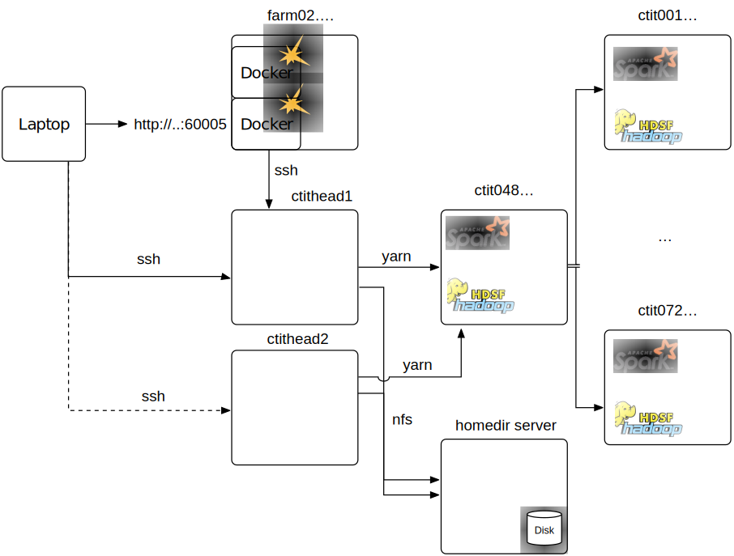

This document describe ways to access and use the Hadoop Cluster of the University of Twente, called CTIT cluster.

# Cluster Structure

The cluster access is structured as follows: 

where:
* the testing environment is to experiment with small amounts of data.
* the cluster environment can process large amounts of data.

# Prerequisites

* You should have a username (referred to as <username>) and password for the cluster (if you don't, apply for it at the system administrator and change the password immediately [here](https://tap.utwente.nl/tap/)).
* This document assumes knowledge about the handline of the following topics:
    * The hadoop file system, a tutorial can be found [here](https://www.tutorialspoint.com/hadoop/hadoop_hdfs_operations.htm).
    * Unix/Linux command line, tutorials can be for example found [here](http://www.ee.surrey.ac.uk/Teaching/Unix/) and [here](http://linuxcommand.org/learning_the_shell.php).
    * Programming with the build system maven, tutorials can be found [here](https://maven.apache.org/guides/getting-started/maven-in-five-minutes.html).
* From a practical side you should have installed:
    * Python interpreter 2.7 (to generate tools from a template)
    * a SSH client, and 
    * a SCP/RSYNC client (note that )

For links to recommended software, see the [software section](#software-links) section below.

# Connecting to the cluster

* SSH to the so-called CTIT head nodes, which serve as entry points to a cluster:
  ``ssh <username>@ctithead1.ewi.utwente.nl``
* Should you be using public key authentification (by default you do not), you have to add an extra authentication step:
  ``kinit <username>`` 

Connection test:

    # list your home directory
    hdfs dfs -ls
    # list the root directory
    hdfs dfs -ls /
    # show currently running jobs
    yarn application -list

# Create Code

Depending on your preferences, you can create code on the ctithead nodes or on your local computer. The following instructions
can be applied for both:

* Check out the source code template directory: 
  ``git clone ssh://<username>@ctithead1.ewi.utwente.nl:/home/alyr/git/ctit-spark.git <projectname>``
* Change into the project's directory: ``cd <projectname>``
* Create a new tool: ``python createTool.sh [python|java|scala] <ToolName>``
* Edit the source file of the tool (displayed on the command line) in an editor of your choice
* If you are onn your local computer, you can upload the source code to the head node, by (note that windows users may have ):
    * ``rsync -avug ./ <username>@ctithead1.ewi.utwente.nl:~/<projectname>/``
    * In subsequent calls it is better to only copy the directory with sources:
      ``rsync -avug ./src/ <username>@ctithead1.ewi.utwente.nl:~/<projectname>/src/``

# Uploading data

If you want to upload data to the cluster follow these steps, we assume your data is in a directory called ``<dir>``:

* Upload data to your home directory on the hosts ``ctithead1.ewi.utwente.nl`` via scp or rsync:
    * ``rsync -avug <dir>/ <username>@ctithead1.ewi.utwente.nl:~/<dir>/``
    * ``scp -r <dir> <username>@ctithead1.ewi.utwente.nl:~/<dir>/`` 
* ssh to the the respective machine
* Optionally create a suitable parent directory for your data on the hdfs, e.g.: ``hdfs dfs -mkdir collections``
* Put a file on the cluster ``hdfs dfs -put <dir> <dir>/``

# Submitting a  Job

* Make sure the most recent version of your code is on the headnode. 
* Connect to the cluster
* Change into the directory where your project resides, see ``<projectname>`` in the [Create Code](#create-code) section.
* Load execution environment: ``. setenv`` 
* Compile code: ``mvn package``
* Fix potential errors
* Submit job to the cluster: 
    * For a **scala or java** job: ``runTool <ToolName> Argument1 Argument 2...`` 
    * For a **python** job: ``runPythonTool <ToolName> Argument1 Argument 2...`` 
 
# Monitoring / Debugging

Debugging distributed systems can be cumbersome. At the moment, the
best strategy is produce log output inside your code. When you run
the application, note down the **applicationId**, starting with
``application\_``, from the output.

To see the progress of your job you can visit the website:

   [http://ctit048.ewi.utwente.nl:8088/cluster](http://ctit048.ewi.utwente.nl:8088/cluster)

Use the following command to read through logs:

    yarn logs --applicationId <applicationId>    
    
If you want to kill an application, you can use:

    yarn application --kill <applicationId>

# Downloading data

To download your data to your local computer follow these steps,
we assume that the data on the hdfs is called ``<output_hdfs>``:

* Connect to the cluster (make sure that you are in the root directory)
* Download the directory output directory ``<output_hdfs>`` from hdfs to your home directory ``<output_nfs>``: 
  ``hdfs dfs -get <output_hdfs> <output_nfs>``
* Disconnect from the cluster
* Copy the data to your computer:
    * Change into the directory where you want to store the data
    * Copy the data by one of the following:
        * ``rsync -avug <username>@ctithead1.ewi.utwente.nl:~/<output_nfs> ./``
        * ``scp <username>@ctithead1.ewi.utwente.nl:~/<output_nfs>/ ./``
 * Now you can further analyze the data.

# Software / Links

## Shells
* Bash shell for windows 10: [here](http://www.howtogeek.com/249966/how-to-install-and-use-the-linux-bash-shell-on-windows-10/)
* Win bash: [here](http://win-bash.sourceforge.net/)

## Connecting from Windows
* Remote access: [Putty](http://www.chiark.greenend.org.uk/~sgtatham/putty/download.html)
* Copy tool for indvidual files: [WinSCP](https://winscp.net/eng/download.php#download2)
* Copy tool for directory trees (not recommended anymore): [DeltaCopy](http://www.aboutmyip.com/AboutMyXApp/DeltaCopy.jsp)
* Copy tool for directory trees: rsync port for windows (recommended as you can use the same command as above) [cwRsync](https://www.itefix.net/content/cwrsync-free-edition)
    * Download, unpack and add the ``bin`` subdirectory to the system's path, following the instructions [here](https://www.google.nl/search?q=rsync+windows&oq=rsync+windows&aqs=chrome..69i57.5373j0j7&sourceid=chrome&ie=UTF-8#q=windows+add+directory+to+path).

## Coding
* Text Editor: [Sublime](https://www.sublimetext.com/)
* Versioning: [Windows Git GUIs](https://git-scm.com/downloads/guis)
* Versioning: [Mac Git GUI](https://www.sourcetreeapp.com/)

## Software repositories
* Spark templates: [Ctit-Spark](https://github.com/robinaly/ctit-spark)
* Hadoop map reduce templates: [Ctit-mapred](https://github.com/robinaly/ctit-mapred)

